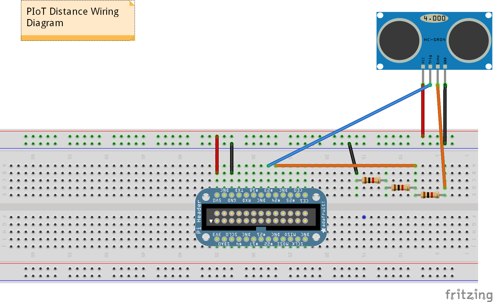

Bill of Materials and Assembly
==============================

Bill of Materials
-----------------

.. TIP::
   It is suggested that you comparison shop using Dr. Google to find the best
   price. The author was unable to find every component from the same site at
   a competitive price.

To build the sump pump monitor, you will need to acquire the following parts:

+---------------------------------------+----------+
| Part                                  | Quantity |
+=======================================+==========+
| Raspberry Pi 2 - Model B              | 1        |
+---------------------------------------+----------+
| Wireless N Nano USB Adapter           | 1        |
+---------------------------------------+----------+
| 5VDC 2A Micro USB Adapter             | 1        |
+---------------------------------------+----------+
| Breadboard                            | 1        |
+---------------------------------------+----------+
| Male to Female Jumper Wire            | 9        |
+---------------------------------------+----------+
| 1k Ohm Resistor                       | 3        |
+---------------------------------------+----------+
| SainSmart HC-SR04 Distance Sensor     | 1        |
+---------------------------------------+----------+
| SD Card (16 GB+ Class 10 recommended) | 1        |
+---------------------------------------+----------+
| Velcro Strip                          | 1        |
+---------------------------------------+----------+
| Adafruit Pi Cobbler                   | 1        |
+---------------------------------------+----------+
| Adafruit Pi Box                       | 1        |
+---------------------------------------+----------+

Assembly
--------

.. DANGER::
   Failure to follow the assembly instructions exactly may result in damage
   to your components. Please be careful!

Assemble the electrical components using the wiring diagram below. In 
addition to following the diagram, you will need to connect the Pi 
Cobbler to the Raspberry Pi and install the Raspberry Pi's case 
as shown below.

You will then have a fully-assembled sump pump monitor similar to the one
below and can setup the Raspberry Pi.

