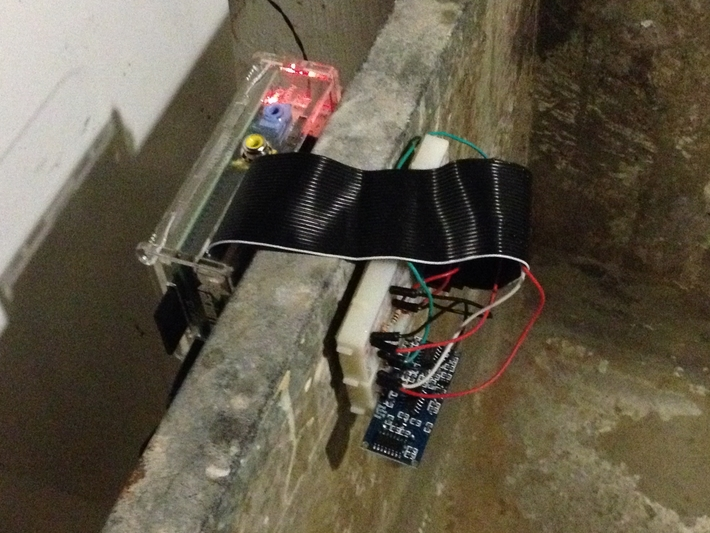

.. Pi of Things (PIoT) documentation master file, created by
   sphinx-quickstart on Mon Jan 11 21:52:32 2016.
   You can adapt this file completely to your liking, but it should at least
   contain the root `toctree` directive.

Pi of Things (PIoT)
===================

What is the Pi of Things (PIoT)?
--------------------------------

The Pi of Things (PIoT) is a learning platform to explore the Internet 
of Things (IoT). The IoT consists of embedded devices that communicate 
with services on the internet, such as smart thermostats. PIoT is an 
open source platform that allows you to interact with sensors, view the 
readings of those sensors over time on a dynamic website that is hosted 
on the Raspberry Pi and receive text message notifications when a sensor 
detects that something has gone wrong. PIoT has a sensor plugin system, 
so you can add plugins for your own sensors in addition to those that 
are provided out of the box.

   
   Raspberry Pi with a distance sensor used to develop the PIoT 
   Software.

Sump Pump Monitor
-----------------

Using the instructions provided, you can build your own sump pump
monitor using the PIoT platform. When aimed at the water in a sump,
a distance sensor checks to make sure the water level is not too
high. If the water level is too high, a text message will be sent,
so you know that something is wrong with your sump pump, saving
you from a flooded basement.

Of course, you are only limited by your imagination and can use PIoT to
monitor any sensor you are willing to write a plugin for.

Acknowledgements
----------------

PIoT was authored by Thomas Newman with guidance from Dr. Chung at 
Lawrence Technological University as part of the Concentration Project 
1 course for the Masters of Science in Computer Science degree.

Table of Contents
-----------------

.. toctree::
   :maxdepth: 2

   self
   bomassembly
   pisetup
   piotsetup
   piotconfiguration
   piotwebinterface
   piotfieldinstallation
   piotcustomsensors

Indices and tables
==================

* :ref:`genindex`
* :ref:`modindex`
* :ref:`search`

