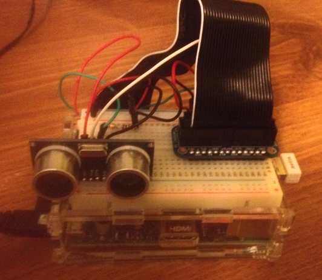

.. Pi of Things (PIoT) documentation master file, created by
   sphinx-quickstart on Mon Jan 11 21:52:32 2016.
   You can adapt this file completely to your liking, but it should at least
   contain the root `toctree` directive.

Welcome to Pi of Things (PIoT)'s documentation!
===============================================

What is the Pi of Things (PIoT)?
--------------------------------

The Pi of Things (PIoT) is a learning platform to explore the Internet 
of Things (IoT). The IoT consists of embedded devices that communicate 
with services on the internet, such as smart thermostats. PIoT is an 
open source platform that allows you to interact with sensors, view the 
readings of those sensors over time and receive text message 
notifications when a sensor detects that something has gone wrong. 
PIoT has a sensor plugin system, so you can add your own sensors in 
addition to those that are supported through our kits.

   
   Raspberry Pi with a distance sensor used to develop the PIoT 
   Software.

PIoT Sump Pump Monitor Kit
--------------------------

We sell a kit for the PIoT platform that allows you to build your own 
sump pump monitor. When placed at the water in a sump, a distance 
sensor checks to make sure the water level is not too high. If the 
water level is too high, a text message will be sent, so you know that 
something is wrong with your sump pump, saving you from a flooded 
basement.

When you purchase the PIoT as a Sump Pump Monitor Kit, you will receive:

+-----------------------------------+----------+
| Part                              | Quantity |
+===================================+==========+
| Raspberry Pi 2 - Model B          | 1        |
+-----------------------------------+----------+
| Wireless N Nano USB Adapter       | 1        |
+-----------------------------------+----------+
| 5VDC 2A Micro USB Adapter         | 1        |
+-----------------------------------+----------+
| Breadboard                        | 1        |
+-----------------------------------+----------+
| Male to Female Jumper Wire        | 9        |
+-----------------------------------+----------+
| 1k Ohm Resistor                   | 3        |
+-----------------------------------+----------+
| SainSmart HC-SR04 Distance Sensor | 1        |
+-----------------------------------+----------+

Once you have the kit, you can follow the installation instructions to 
install the PIoT open source software on your Raspberry Pi and 
configure it to work with the kit.

Contents:

.. toctree::
   :maxdepth: 2

Indices and tables
==================

* :ref:`genindex`
* :ref:`modindex`
* :ref:`search`

